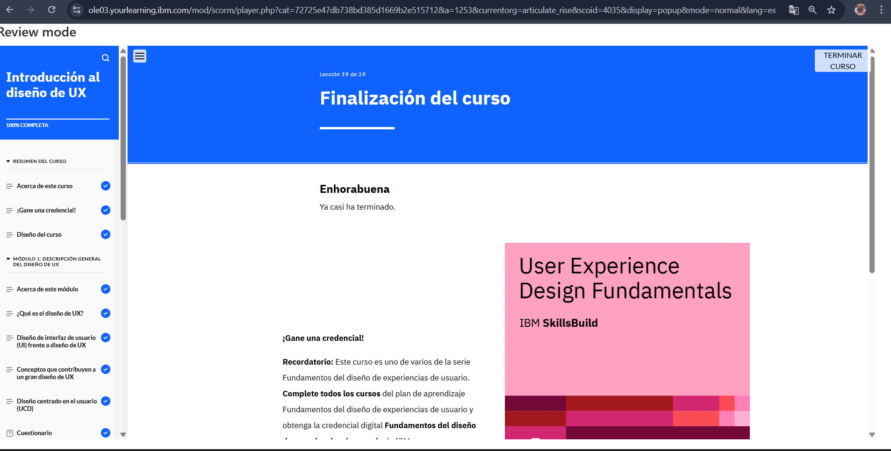

# Módulo 1: Introducción al Diseño de UX

## Objetivos del curso

Después de completar este curso, debería ser capaz de:

Explicar la finalidad, los aspectos principales, el valor y los conceptos fundamentales que contribuyen al diseño de experiencias de usuario (UX).
Diferenciar entre el enfoque del diseño de interfaz de usuario (UI) y el diseño de UX
Explicar los pasos del proceso de diseño centrado en el usuario (UCD).
Identificar las competencias y cualidades de un gran diseñador de UX que ayuda a diseñar experiencias de usuario inclusivas y reactivas
Diferenciar entre diseños adaptativos y reactivos
Explicar qué es un caso práctico en el diseño de UX y los pasos para crearlo
Revisar un ejemplo de caso práctico de diseño de UX para sacar conclusiones sobre la definición de requisitos

## Descripción
Este módulo establece las bases del Diseño de Experiencia de Usuario (UX), destacando su importancia y diferenciación de otros campos como UI.

## Lo que aprendí
- UX no se trata solo de estética, sino de resolver problemas reales para los usuarios.
- La empatía es clave para comprender al usuario y sus necesidades.
- UX y UI están relacionadas, pero no son lo mismo.

## Reflexión
Me sorprendió descubrir cómo pequeños detalles pueden mejorar significativamente la experiencia de un usuario.

## Imagen 

