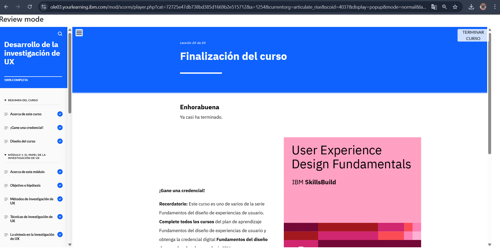

# Módulo 2: Desarrollo de la Investigación de UX

## Objetivos del curso

Después de completar este curso, debería ser capaz de:

- Describir la importancia de la investigación de usuarios en el diseño de UX
- Explicar el objetivo y la importancia de las hipótesis en la investigación de UX  
- Identificar los métodos y técnicas utilizados para llevar a cabo una investigación de UX.
- Describir el objetivo y la importancia de la síntesis de datos 
- Explicar los distintos marcos para sintetizar los datos de una investigación de UX
- Explicar la finalidad, la importancia y los principales componentes de los usuarios prototipo
- Describir el proceso de creación de un usuario prototipo
- Describir el proceso de utilización de usuarios prototipo durante el proceso de diseño de UX
- Explicar los análisis competitivo y comparativo
- Identificar los pasos y marcos comunes para llevar a cabo un análisis competitivo y comparativo
- Analizar un ejemplo de caso práctico de diseño de UX para sacar conclusiones sobre la investigación de usuarios, la creación de usuarios prototipo y la investigación de la competencia

## Descripción
Este módulo cubre la importancia de la investigación en UX y los métodos para recopilar información valiosa.

## Lo que aprendí
- Aplicar entrevistas, encuestas y análisis de comportamiento para entender mejor a los usuarios.
- Analizar datos sin sesgos y detectar puntos de dolor.
- Cómo la investigación fundamenta cada decisión de diseño.

## Reflexión
Ponerme en el lugar del usuario cambió completamente mi forma de ver el diseño.

## Imagen

