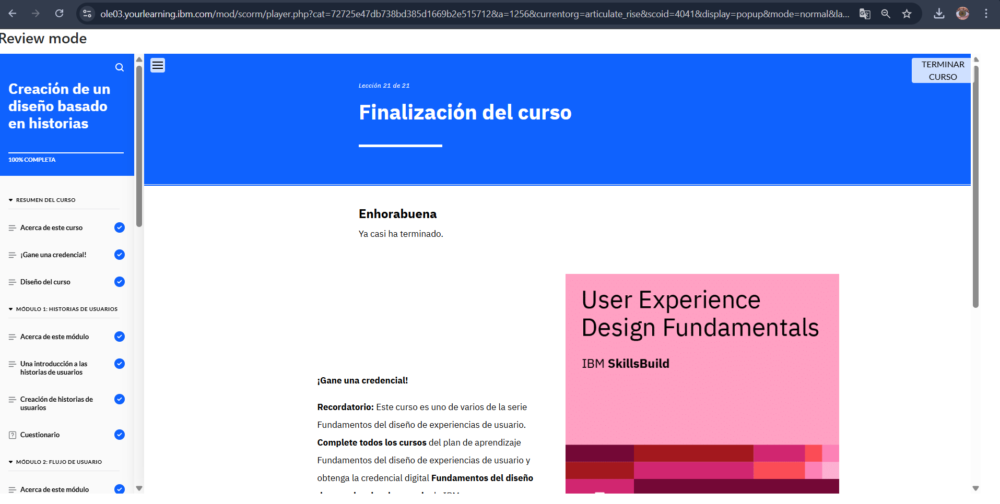

# Módulo 3: Creación de un Diseño Basado en Historias

## Objetivos del curso

Después de completar este curso, debería ser capaz de:

- Explicar las historias de usuarios y su importancia en la creación de un diseño centrado en el usuario 
- Identificar los principales componentes y el formato de una historia de usuario 
- Identificar los pasos para crear una historia de usuario con la ayuda de usuarios prototipo 
- Explicar un recorrido de usuario y su importancia en el diseño de UX
- Explicar un flujo de usuario y su aplicación en el diseño de UX
- Describir un flujo de tareas
- Identificar los pasos para combinar los recorridos del usuario y los flujos de usuario para mejorar el diseño de UX 
- Explicar el objetivo, la importancia y los tipos de bocetos de solución
- Identificar los pasos para planificar y desarrollar una sesión de creación de bocetos en colaboración
- Explicar la metodología ágil y su importancia
- Analizar un ejemplo de caso práctico de diseño de UX para sacar conclusiones sobre la creación de historias de usuarios, recorrido de usuario, flujos de usuario y bocetos de soluciones

## Descripción
Este módulo explora cómo contar historias ayuda a visualizar las experiencias del usuario.

## Lo que aprendí
- Convertir información en "user stories" que representan necesidades reales.
- Crear "user personas" para segmentar diferentes tipos de usuarios.
- Desarrollar flujos de experiencia estructurados.

## Reflexión
Transformar datos en historias hace que las necesidades del usuario sean más tangibles y fáciles de diseñar.

## Imagen

