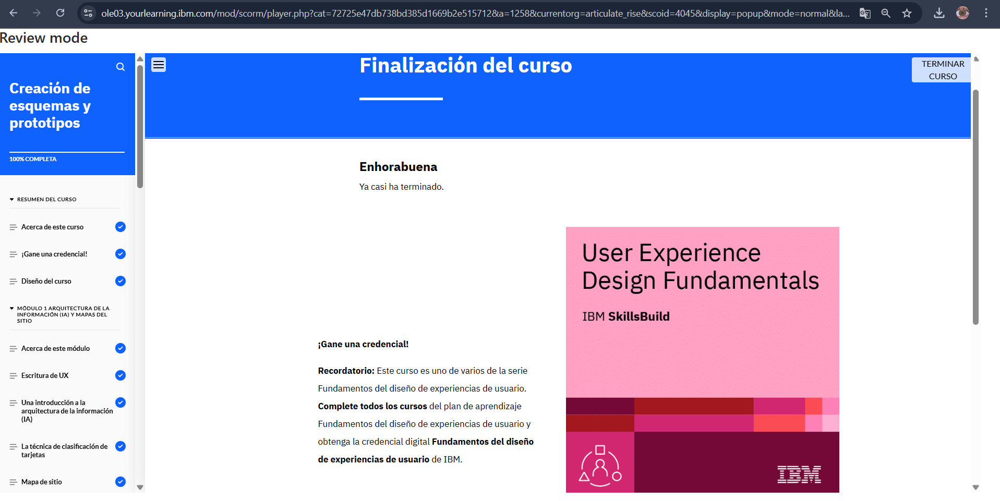

# Módulo 4: Creación de Esquemas y Prototipos

## Objetivos del curso

Después de completar este curso, debería ser capaz de:

- Explicar la escritura de experiencias del usuario (UX) y las buenas prácticas para una escritura de UX eficaz
- Definir la arquitectura de la información (IA) y su finalidad en el proceso de diseño de UX
- Describir un mapa de sitio y los pasos para crearlo
- Explicar un esquema y su finalidad
- Describir los tipos de esquemas
- Analizar un ejemplo de caso práctico de diseño de UX para sacar conclusiones sobre cómo crear la IA, un mapa de sitio y esquemas
- Describir el diseño de la interfaz de usuario (UI) y sus principios 
- Identificar los objetivos y las buenas prácticas para garantizar la accesibilidad de los productos digitales
- Explicar las técnicas de creación de prototipos
- Describir la importancia de la creación de prototipos en el diseño de UX
- Analizar un ejemplo de caso práctico de diseño de UX para sacar conclusiones sobre cómo crear el diseño de UI y prototipos

## Descripción
Aquí pasamos de ideas abstractas a representaciones visuales de las soluciones.

## Lo que aprendí
- Hacer wireframes en papel y digitales antes de diseñar en alta fidelidad.
- Construir prototipos básicos y probar flujos de interacción.
- Experimentar con diferentes layouts para mejorar la experiencia.

## Reflexión
Tener un prototipo me ayudó a entender lo que realmente funciona y lo que no antes de invertir más tiempo en detalles.

## Imagen

