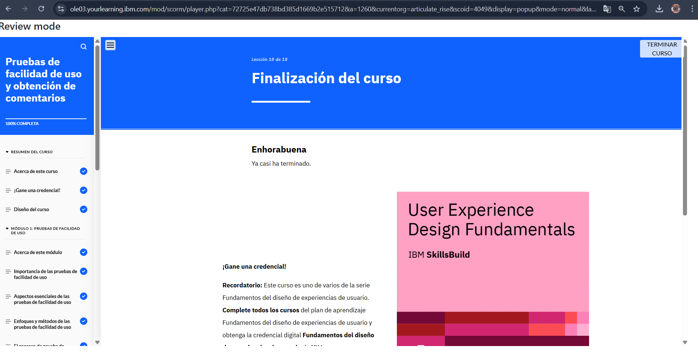

# Módulo 5: Pruebas de Facilidad de Uso y Obtención de Comentarios

## Objetivos del curso

Después de completar este curso, debería ser capaz de: 

- Explicar la importancia, los objetivos y los principales elementos de las pruebas de facilidad de uso
- Diferenciar entre pruebas de facilidad de uso cualitativas y cuantitativas
- Describir los distintos métodos cualitativos y cuantitativos de realizar pruebas de facilidad de uso
- Describir el proceso de pruebas de facilidad de uso 
- Describir la evaluación heurística
- Identificar herramientas comunes para realizar pruebas de facilidad de uso 
- Explicar los distintos niveles de gravedad y la matriz impacto-esfuerzo para priorizar problemas
- Describir el proceso de recabar e incorporar comentarios sobre facilidad de uso para ultimar los diseños de UX
- Revisar un ejemplo de caso práctico de diseño de UX para sacar conclusiones sobre la creación de un plan de pruebas de facilidad de uso, el análisis de los comentarios y su documentación en un informe, y la revisión del prototipo 

## Descripción
Este módulo explica cómo validar un diseño con usuarios reales y obtener feedback.

## Lo que aprendí
- Observar cómo los usuarios interactúan con mi diseño es más valioso que solo preguntarles.
- Las pruebas A/B son útiles para comparar soluciones.
- La retroalimentación constante permite mejorar un diseño iterativamente.

## Reflexión
Ver a los usuarios interactuar con mi diseño me mostró errores que no había notado antes.

## Imagen 

