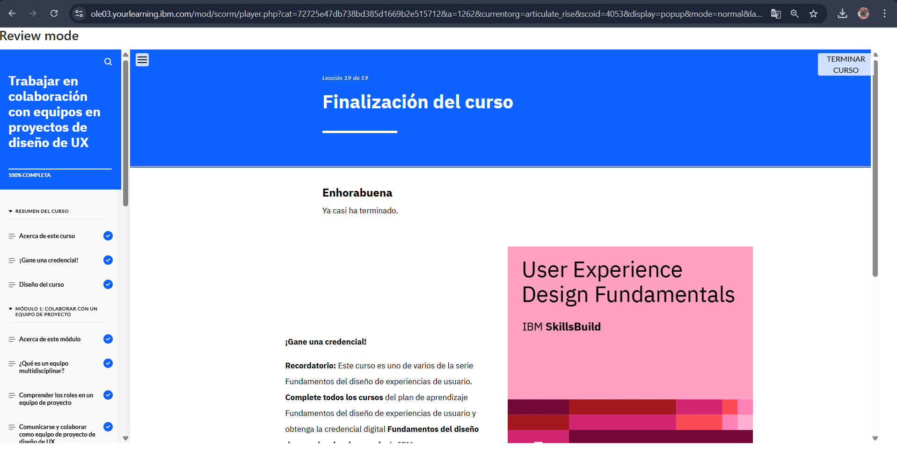

# Módulo 6: Trabajo en Colaboración con Equipos en Proyectos de Diseño de UX

## Objetivos del curso

Después de completar este curso, debería ser capaz de: 

- Describir un equipo multidisciplinar y sus ventajas
- Diferenciar los roles en un equipo de proyecto de diseño de UX
- Explicar las buenas prácticas para comunicarse y colaborar eficazmente como un equipo de proyecto de diseño de UX
- Explicar el rol de un desarrolladora durante las fases generales de un proyecto de diseño de UX 
- Reconocer la importancia de la comunicación entre el equipo de diseño y el de desarrollo
- Describir los elementos de diseño que se deben traspasar al equipo de desarrollo
- Explicar la importancia y los criterios para revisar y probar un producto digital desarrollado 
- Explicar las normas y directrices del proyecto para documentar un proyecto de diseño de UX
- Describir las consideraciones importantes para gestionar correctamente archivos y versiones 
- Revisar un ejemplo de caso práctico de diseño de UX para sacar conclusiones sobre los miembros del equipo que participarán en el proyecto, la identificación de las formas de colaboración y los elementos de diseño que se traspasarán al equipo de desarrollo, y la revisión del producto digital final

## Descripción
Este módulo destaca la importancia de la colaboración en UX.

## Lo que aprendí
- Trabajar con equipos multidisciplinarios mejora el diseño final.
- La comunicación clara es clave para transmitir ideas efectivamente.
- Usar herramientas de gestión de proyectos facilita la organización del trabajo.

## Reflexión
Colaborar con otras personas me dio una nueva perspectiva y enriqueció mis ideas.

## Imagen

