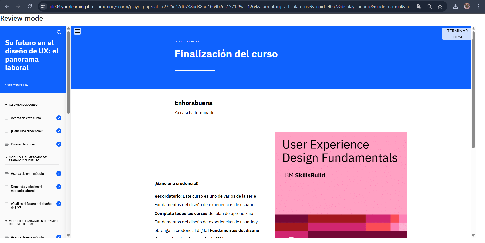

# Módulo 7: Su Futuro en el Diseño de UX y el Panorama Laboral

## Objetivos del curso

Después de completar este curso, debería ser capaz de: 

- Identificar los sectores en los que trabajan los diseñadores de UX 
- Conocer la demanda global de diseñadores de UX en el mercado laboral 
- Conocer el futuro del campo del diseño de UX 
- Identificar roles comunes en el campo del diseño de UX 
- Explicar las principales responsabilidades de un diseñador de UX 
- Identificar las competencias que necesitan los diseñadores de UX 
- Identificar recursos para aprender más y estar siempre al día en el campo del diseño de UX

## Descripción
Este último módulo me ayudó a visualizar oportunidades dentro del campo de UX.

## Lo que aprendí
- La importancia de construir un portafolio UX atractivo.
- Explorar distintas especializaciones dentro del diseño de experiencia.
- Seguir aprendiendo y actualizándome sobre tendencias UX.

## Reflexión
Este módulo me dejó motivado para seguir explorando UX y buscar oportunidades en el campo.

## Imagen 

