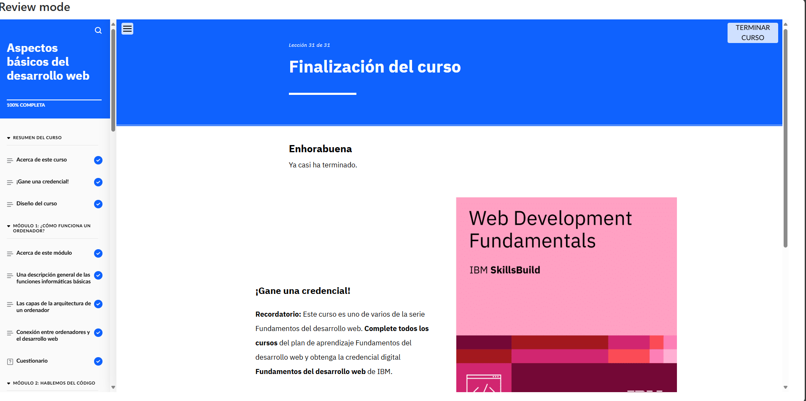

# Módulo 1: Aspectos básicos del desarrollo web

## Objetivos del curso

- Describir las funciones básicas de un ordenador.

- Diferenciar entre hardware y software.

- Describir los tipos de lenguajes de programación.

- Explicar cómo un ordenador lee el código.

- Diferenciar entre diseño web y desarrollo web.

- Identificar los componentes de un sitio web.

- Explicar los pasos principales del proceso de desarrollo web.

- Diferenciar entre los procesos del lado del cliente y los del lado del servidor. 

- Identificar las áreas principales y los lenguajes más comunes para el desarrollo front-end.

- Identificar las áreas principales y los lenguajes más comunes para el desarrollo back-end.

- Diferenciar entre la World Wide Web e Internet.

- Explicar cómo la nube beneficia al desarrollo web.

## Lo que aprendí

En este módulo comprendí los conceptos fundamentales del desarrollo web, incluyendo cómo funciona Internet, el papel de los navegadores y servidores, y la diferencia entre frontend y backend. Me dio una visión general del ecosistema web y me ayudó a entender cómo encajan todas las piezas.

## Evidencia 
