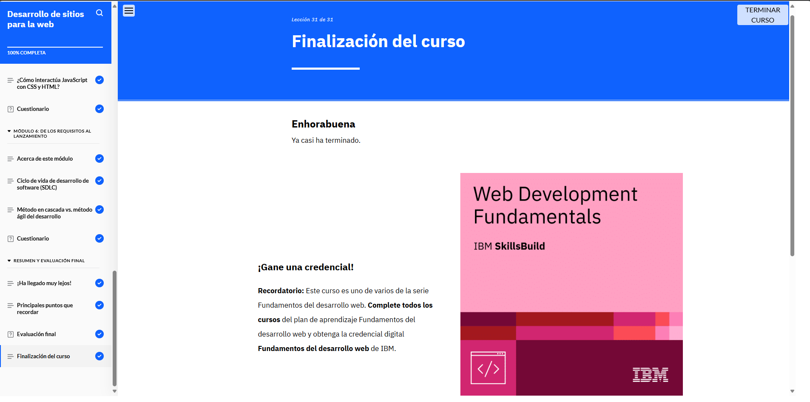

# Módulo 2: Desarrollo de sitios para la web

## Objetivos del curso

- Identificar la finalidad de los exploradores web.

- Describir los lenguajes de marcado y los desafíos que pueden superar.

- Explicar la estructura, las funciones y la evolución del código HTML.

- Identificar las mejoras que introdujo HTML5.

- Explicar las características y funciones de CSS.

- Explicar las características y funciones de JavaScript.

- Identificar de qué formas JavaScript interactúa con CSS y HTML.

- Identificar las fases del ciclo de vida de desarrollo de software (SDLC).

- Diferenciar entre el enfoque en cascada y el enfoque ágil del desarrollo.

- Destacar el marco Scrum.

## Lo que aprendí

En este módulo aprendí cómo funcionan los navegadores web y la importancia de los lenguajes de marcado como HTML y CSS. Conocí las mejoras de HTML5 y cómo
JavaScript se integra con HTML y CSS para hacer sitios dinámicos. También entendí el ciclo de vida del desarrollo de software y las diferencias entre los enfoques 
en cascada y ágil, destacando el marco Scrum.

## Evidencia 
