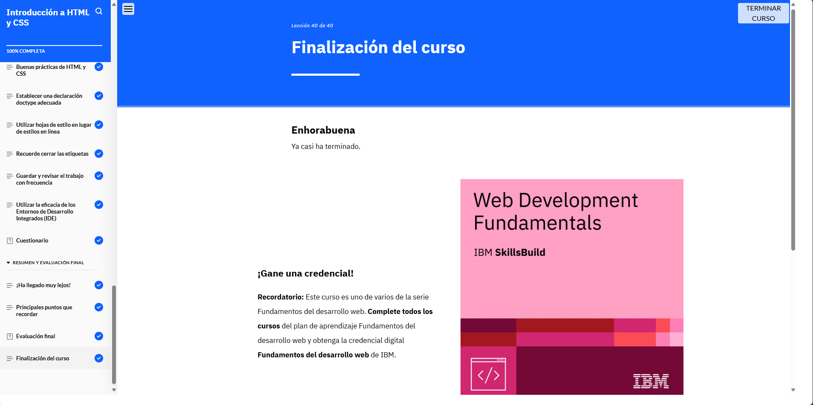

# Módulo 3: Introducción a HTML y CSS

## Objetivos del curso

- Describir cómo los desarrolladores web utilizan elementos HTML para crear una página web.

- Identificar y explicar los elementos HTML más comunes.

- Definir los atributos y usos de HTML.

- Identificar y explicar los atributos más comunes.

- Identificar las técnicas para organizar el código que benefician a los desarrolladores y los usuarios web.

- Describir los métodos y técnicas para aplicar CSS a HTML.

- Describir el modelo de cuadro CSS y los componentes de los cuadros CSS.

- Describir las buenas prácticas para escribir código HTML y CSS.

- Describir las características principales de un entorno de desarrollo integrado (IDE) que ayudan a mejorar el flujo de trabajo de los desarrolladores web.

## Lo que aprendí

En este módulo aprendí a usar los elementos y atributos más comunes de HTML para estructurar páginas web. También descubrí cómo aplicar estilos con CSS, 
entendiendo el modelo de caja y las mejores prácticas para escribir un código limpio y organizado. Además, conocí cómo un entorno de desarrollo integrado (IDE) 
puede mejorar mi productividad como desarrollador.

## Evidencia 
