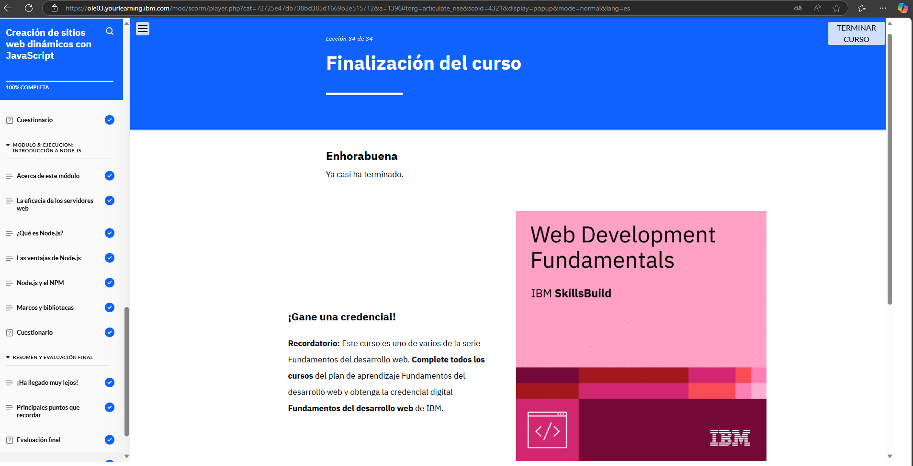

# Módulo 4: Creación de sitios web dinámicos con JavaScript

## Objetivos del curso

- Explicar la sintaxis de JavaScript.

- Identificar las técnicas que los desarrolladores web utilizan para incluir JavaScript en HTML.

- Comparar y contrastar distintos modelos de programación.

- Explicar cómo utilizar objetos de código.

- Explicar el funcionamiento de las variables, las funciones, las expresiones, los operadores y los sucesos en el código JavaScript para sitios web dinámicos.

- Definir los tipos de datos más comunes.

- Identificar las cuatro funciones principales de base de datos.

- Reconocer una sintaxis MySQL simple para crear una base de datos y trabajar con los datos.

- Explicar la finalidad y la función de Node.js.

## Lo que aprendí

En este módulo aprendí la sintaxis básica de JavaScript y cómo integrarlo en HTML para crear sitios dinámicos. Comprendí el uso de variables, funciones, 
operadores y eventos, así como los distintos modelos de programación y el trabajo con objetos. También me introduje en conceptos de bases de datos, funciones 
básicas en MySQL y conocí la utilidad de Node.js en el desarrollo web.

## Evidencia 
