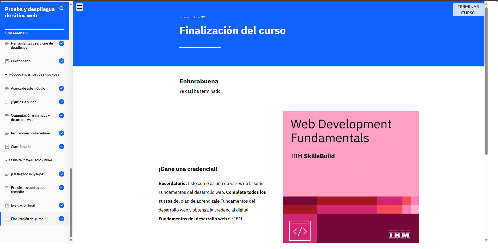

# Módulo 5: Prueba y despliegue de sitios web

## Objetivos del curso

- Identificar distintos tipos de pruebas para sitios web y las áreas a probar.

- Describir las ventajas de las pruebas automatizadas.

- Explicar los sistemas de control de versiones para el desarrollo web.

- Identificar los pasos para publicar un sitio web.
- Diferenciar entre entrega continua y despliegue continuo.

- Describir la finalidad, las ventajas y los flujos de trabajo en el ciclo de vida de DevOps.

- Describir qué es el diseño reactivo y su importancia.

- Explicar la entrega de contenido web como un sitio web.

- Explicar la entrega de contenido web en una aplicación web.

- Diferenciar entre contenedores y máquinas virtuales.

- Identificar los métodos y las herramientas más comunes para probar y automatizar el despliegue de sitios web.

- Explicar la computación en la nube para el desarrollo y despliegue web.

- Explicar la inclusión en contenedores para el desarrollo y el despliegue de sitios web.

## Lo que aprendí

En este módulo aprendí sobre los distintos tipos de pruebas para sitios web y la importancia de automatizarlas. Conocí el uso de sistemas de control de versiones, 
los pasos para publicar un sitio y las diferencias entre entrega y despliegue continuo. También exploré el ciclo DevOps, el diseño web responsivo, la computación 
en la nube, los contenedores, y herramientas modernas para probar y desplegar aplicaciones web de forma eficiente.

## Evidencia 
