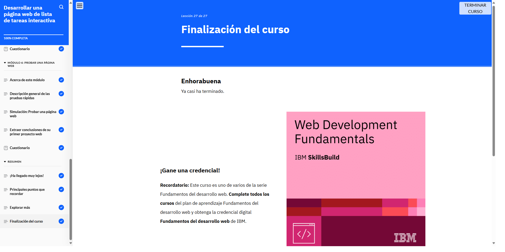

# Módulo 6: Desarrollar una página web de lista de tareas interactiva

## Objetivos del curso

- Identificar las herramientas y los conocimientos necesarios para desarrollar una página web.

- Revisar los requisitos y un diagrama de wireframes como ayuda para definir el desarrollo web.

- Utilizar Visual Studio Code (VS Code) como herramienta de entorno de desarrollo integrado (IDE) para configurar los archivos de proyecto y desarrollar una página web.

- Crear una estructura HTML básica para diseñar una página web.

- Utilizar CSS para añadir estilos a una página web.

- Utilizar JavaScript para crear elementos interactivos en una página web.

- Realizar una prueba funcional simple en una página web.

## Lo que aprendí

En este módulo puse en práctica mis conocimientos desarrollando una página web funcional. Usé Visual Studio Code como entorno de desarrollo para crear la 
estructura con HTML, aplicar estilos con CSS y añadir interactividad con JavaScript. También aprendí a interpretar wireframes, configurar archivos del proyecto y 
realizar pruebas básicas para asegurar el funcionamiento del sitio.

## Evidencia 
