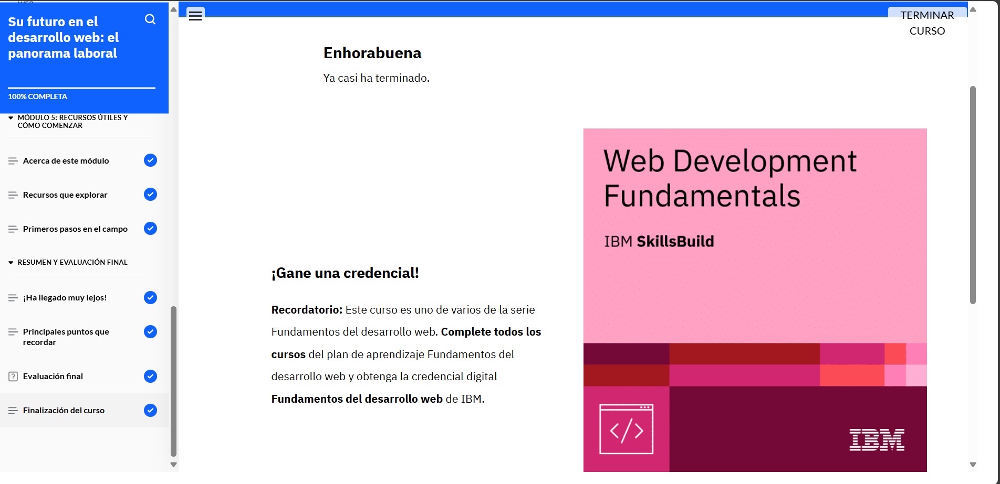

# Módulo 7: Su futuro en el desarrollo web: el panorama laboral

## Objetivos del curso

- Identificar los sectores en los que trabajan los desarrolladores web.

- Reconocer la demanda global de profesionales del desarrollo web en el mercado laboral.

- Reconocer el futuro del campo del desarrollo web. 

- Identificar los roles y las especialidades más comunes en el campo del desarrollo web. 

- Explicar las responsabilidades principales de los distintos roles del desarrollo web. 

- Identificar las competencias que necesitan los desarrolladores web. 

- Distinguir entre los distintos roles de un equipo de desarrollo web.

- Identificar recursos para aprender más y estar siempre al día en el campo del desarrollo web.

## Lo que aprendí

En este módulo exploré el campo laboral del desarrollo web, conociendo los sectores donde puedo trabajar y la 
creciente demanda de profesionales en esta área. Aprendí sobre los roles más comunes, sus responsabilidades y las 
competencias clave que se requieren. También comprendí cómo se organizan los equipos de desarrollo y descubrí 
recursos útiles para seguir aprendiendo y mantenerme actualizado en el mundo del desarrollo web.

## Evidencia 
