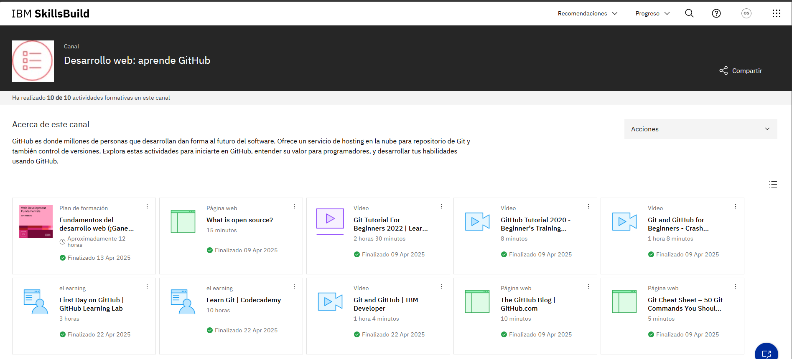

# Canal Desarrollo web: aprende GitHub

Este canal me resultó muy útil para recordar cómo usar GitHub. Aunque ya había visto algunas cosas antes, necesitaba reforzar conceptos y volver a lo básico. Los cursos están muy 
bien explicados, van paso a paso y no hacen falta conocimientos previos para seguirlos. Gracias a eso, volví a familiarizarme con el control de versiones, la colaboración en 
proyectos y la organización del código. Además, los contenidos son bastante prácticos, lo que me ayudó a afianzar lo aprendido.

## Evidencia actividad
