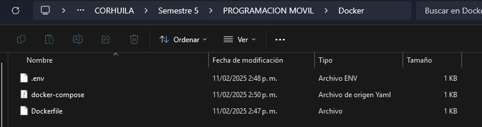

# Documentación sobre la creación del contenedor en Docker y la conexión de este con Workbench

### Estudiante:
- Oscar Guillermo Sierra Lozano.

## Paso 1:
Se ubican los archivos de ".env" , "Docker-compose-yml" y "Dockerfile" en una carpeta.

### Imagen representativa:

## Paso 2:
Se inspeccionan los tres archivos (.env , Docker-compose-yml , Dockerfile).

### Imagen observando la carpeta .env

### Imagen obserando la carpeta 

- En este caso al momento de montar el contenedor me generaba un error en el puerto porque ya estaba en uso, solamente cambie el puerto al 3307.

### Imagen observando la carpeta del Dockerfile

## Paso 3:
Despues de esas comprobaciones procedemos a usar los comandos para crear y montar el contenedor.
Los comandos usados son:
- docker build -t custom-mysql .
- docker-compose down
- docker-compose up -d --build

### Imagen representativa:

## Paso 4: 
Pasamos a Workbench para conectarnos a la base de datos del contenedor que tenemos corriendo, tener en cuenta en poner correctamente el puerto y la contraseña que se esta usando.

### Imagen demostrativa:

## Paso 5:
Empezamos a comprobar que todo funcione correctamente y que este bien enlazada la base de datos del contenedor en Workbench.

### Imagenes demostrativas:

