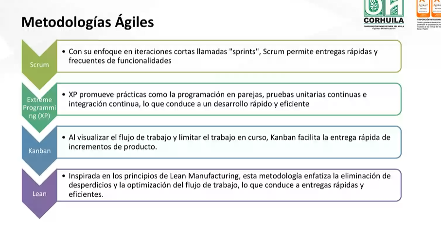
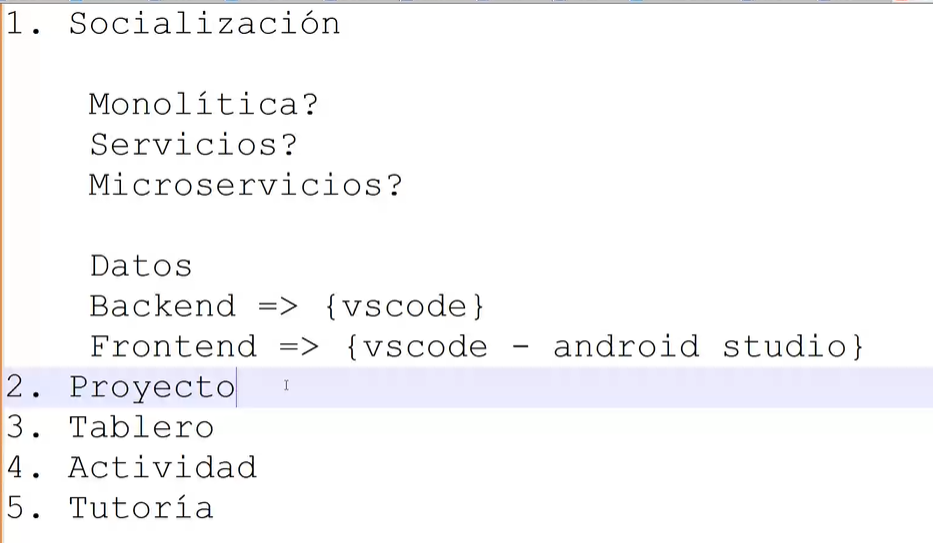

# Agilismo 
Es un enfoque colaborativo y flexible para el desarrollo de proectos, especialmente en el Software. La idea es mejorar la adaptabilidad y calidad de entrega de los productos.

## IDES de programación

- Visual Studio code.
- Intellij idea.
- Eclipse.
- Neatbeans.

## Metodologías Ágiles

- Scrum.
- Extreme Programming (XP).
- Kanban.
- Lean.

## Fotos

### Link espacio de trabajo trello: 
[Enlace Trello](https://trello.com/invite/b/67b490337309e8d18b829fed/ATTIfacd2b419dfbc1099f85a3360c194875569FE830/aplicacion-cafeteria)