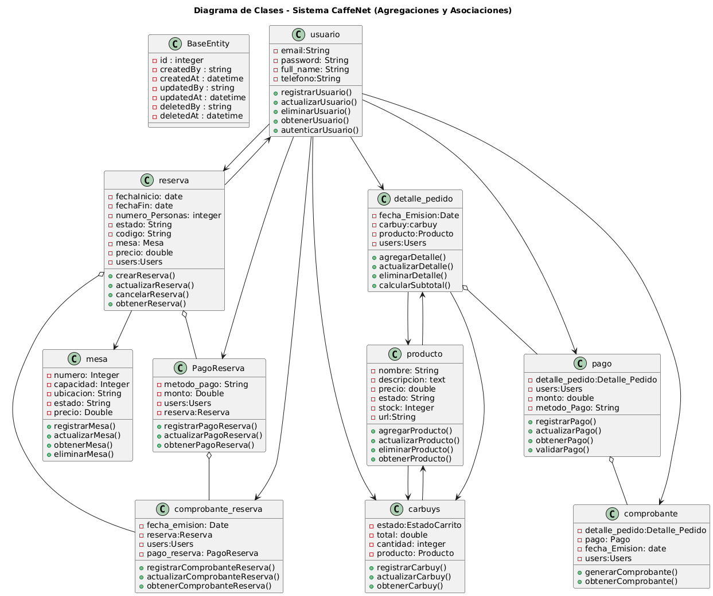

#  Documentación de Clases - Sistema CaffeNet

---

##  Clase: `BaseEntity`

Clase base que proporciona atributos comunes para todas las entidades, como trazabilidad de creación, modificación y eliminación de datos.

### Atributos:
- `id`: Identificador único de la entidad.
- `createdBy`: Usuario que creó el registro.
- `createdAt`: Fecha y hora de creación.
- `updatedBy`: Usuario que modificó por última vez.
- `updatedAt`: Fecha y hora de la última modificación.
- `deletedBy`: Usuario que eliminó el registro.
- `deletedAt`: Fecha y hora de eliminación.

---

##  Clase: `usuario`

Representa a los usuarios que interactúan con el sistema, incluyendo clientes, administradores y empleados. Gestiona el acceso, autenticación y perfil del usuario.

### Atributos:
- `email:` Correo electrónico del usuario.

- `password:` Contraseña de acceso.

- `full_name:` Nombre completo del usuario.

- `telefono:` Número de contacto.

### Métodos:
- `registrarUsuario()`: Registra un nuevo usuario.
- `actualizarUsuario()`: Modifica los datos de un usuario existente.
- `eliminarUsuario()`: Elimina un usuario del sistema.
- `obtenerUsuario()`: Recupera información de un usuario.
- `autenticarUsuario()`: Verifica las credenciales de acceso.

---

##  Clase: `reserva`

Administra las reservas de mesas realizadas por los usuarios, registrando la fecha, hora, número de personas y el estado de la solicitud.

### Atributos:
- `fechaInicio:` Fecha de inicio de la reserva.
- `fechaFin:` Fecha de finalización.
- `numero_Personas:` Número de personas que asistirán.
- `estado:` Estado actual de la reserva.
- `codigo:` Código de reserva generado.
- `mesa:` Mesa asignada.
- `precio:` Precio total de la reserva.
- `users:` Usuario que realiza la reserva.

### Métodos:
- `crearReserva()`: Crea una nueva reserva.
- `actualizarReserva()`: Modifica datos de la reserva.
- `cancelarReserva()`: Cancela una reserva existente.
- `obtenerReserva()`: Consulta detalles de una reserva.

---

##  Clase: `producto`

Define los productos disponibles en el menú del café, como bebidas o alimentos, con información sobre su precio, descripción y disponibilidad.

### Atributos:
- ``nombre:`` Nombre del producto.
- ``descripcion:`` Detalles del producto.
- ``precio:`` Precio unitario.
- ``estado:`` Disponibilidad.
- ``stock:`` Cantidad disponible.
- ``url:`` Imagen o recurso del producto.

### Métodos:
- `agregarProducto()`: Crea un producto nuevo.
- `actualizarProducto()`: Actualiza datos del producto.
- `eliminarProducto()`: Elimina un producto.
- `obtenerProducto()`: Muestra la información del producto.

---

##  Clase: `detalle_pedido`

Especifica los productos individuales dentro de un pedido, incluyendo la cantidad de unidades y el subtotal correspondiente.

### Atributos:
- `fecha_Emision:` Fecha de creación del detalle.
- `carbuy:` Carrito relacionado.
- `producto:` Producto incluido.
- `users:` Usuario que lo solicitó.

### Métodos:
- `agregarDetalle()`: Agrega ítems al pedido.
- `actualizarDetalle()`: Modifica la cantidad o producto.
- `eliminarDetalle()`: Elimina una línea del pedido.
- `calcularSubtotal()`: Calcula el subtotal por producto.

---

##  Clase: `pago`

Gestiona los pagos realizados por los usuarios al completar sus pedidos, incluyendo el monto pagado y el método utilizado.

### Atributos:
- `detalle_pedido:` Detalle del pedido relacionado.
- `users:` Usuario que paga.
- `monto:` Monto total pagado.
- `metodo_Pago:` Método de pago utilizado.

### Métodos:
- `registrarPago()`: Registra un nuevo pago.
- `actualizarPago()`: Modifica el monto o método.
- `obtenerPago()`: Consulta los datos de un pago.
- `validarPago()`: Verifica que el pago sea válido.

---

##  Clase: `comprobante`

Genera y almacena la información de los comprobantes emitidos luego de un pago realizado por un pedido.

### Atributos:
- `detalle_pedido:` Detalle del pedido asociado.
- `pago:` Pago correspondiente.
- `fecha_Emision:` Fecha de emisión.
- `users:` Usuario receptor.

### Métodos:
- `generarComprobante()`: Crea un comprobante nuevo.
- `obtenerComprobante()`: Muestra el comprobante generado.

---

##  Clase: `mesa`

Representa las mesas disponibles en el café, con detalles como número, capacidad, ubicación y estado (disponible u ocupada).

### Atributos:
- `numero:` Número identificador de la mesa.
- `capacidad:` Capacidad de personas.
- `ubicacion:` Ubicación física.
- `estado:` Estado actual (libre, reservada, ocupada).
- `precio:` Costo de reserva.

Métodos:

### Métodos:
- `registrarMesa()`: Registra una nueva mesa.
- `actualizarMesa()`: Modifica detalles de la mesa.
- `obtenerMesa()`: Consulta información de una mesa.
- `eliminarMesa()`: Elimina una mesa del sistema.

---

##  Clase: `carbuys`

Representa los productos y cantidades seleccionadas por un usuario dentro del carrito de compras, incluyendo el costo total.

### Atributos:
- `estado:` Estado del carrito (activo, cerrado, etc).
- `total:` Total acumul`ado.
- `cantidad:` Cantidad de productos.
- `producto:` Producto agregado al carrito.
## Métodos:
- `registrarCarbuy()`: Agrega un ítem al carrito.
- `actualizarCarbuy()`: Cambia cantidad o producto.
- `obtenerCarbuy()`: Consulta productos en el carrito.

---

##  Clase: `PagoReserva`

Maneja la información de los pagos realizados para confirmar reservas de mesas, incluyendo el monto y el método de pago.

### Atributos:
- `metodo_pago:` Forma de pago utilizada.
- `monto:` Monto pagado.
- `users:` Usuario que realiza el pago.
- `reserva:` Reserva asociada.

### Métodos:
- `registrarPagoReserva()`: Registra el pago de una reserva.
- `actualizarPagoReserva()`: Cambia datos del pago.
- `obtenerPagoReserva()`: Consulta información del pago.

---

##  Clase: `comprobante_reserva`

Genera el comprobante asociado al pago de una reserva de mesa, registrando la fecha de emisión y los detalles del pago realizado.

### Atributos:
- `fecha_emision:` Fecha en la que se emitió.
- `reserv:` Reserva correspondiente.
- `users:` usuario relacionado.
- `pago_reserva:` Pago asociado.

### Métodos:
- `registrarComprobanteReserva()`: Genera un comprobante nuevo.
- `actualizarComprobanteReserva()`: Modifica su información.
- `obtenerComprobanteReserva()`: Muestra los datos del comprobante.

---
## relaciones:
| Clase Origen     | Tipo Relación  | Clase Destino         | Descripción                                                   |
| ---------------- | -------------- | --------------------- | ------------------------------------------------------------- |
| `usuario`        | Asociación     | `reserva`             | Un usuario puede hacer varias reservas.                       |
| `usuario`        | Asociación     | `detalle_pedido`      | Un usuario está asociado a los detalles de sus pedidos.       |
| `usuario`        | Asociación     | `pago`                | Un usuario puede realizar varios pagos.                       |
| `usuario`        | Asociación     | `comprobante`         | Un usuario puede recibir varios comprobantes de pago.         |
| `usuario`        | Asociación     | `carbuys`             | Un usuario puede tener múltiples registros en su carrito.     |
| `usuario`        | Asociación     | `PagoReserva`         | Un usuario puede hacer varios pagos de reserva.               |
| `usuario`        | Asociación     | `comprobante_reserva` | Un usuario puede recibir varios comprobantes de reserva.      |
| `detalle_pedido` | Asociación     | `producto`            | Un detalle de pedido está vinculado a un producto específico. |
| `detalle_pedido` | Asociación     | `carbuys`             | Un detalle de pedido puede relacionarse con un carrito.       |
| `detalle_pedido` | Agregación     | `pago`                | Un detalle de pedido puede tener pagos asociados.             |
| `pago`           | Agregación     | `comprobante`         | Un pago genera un comprobante de pago.                        |
| `producto`       | Asociación     | `carbuys`             | Un producto puede estar incluido en varios carritos.          |
| `producto`       | Asociación     | `detalle_pedido`      | Un producto puede figurar en múltiples detalles de pedido.    |
| `carbuys`        | Asociación     | `producto`            | Una entrada de carrito está vinculada a un producto.          |
| `reserva`        | Asociación     | `mesa`                | Una reserva se asocia a una mesa específica.                  |
| `reserva`        | Asociación     | `usuario`             | Una reserva es realizada por un usuario.                      |
| `reserva`        | Agregación     | `PagoReserva`         | Una reserva puede tener un pago asociado.                     |
| `reserva`        | Agregación     | `comprobante_reserva` | Una reserva puede generar un comprobante.                     |
| `PagoReserva`    | Agregación     | `comprobante_reserva` | Un pago de reserva genera un comprobante.                     |

## conclusion
El diagrama de clases de CaffeNet presenta una estructura clara y bien organizada que permite gestionar usuarios, pedidos, reservas y pagos de forma eficiente. Las relaciones entre clases reflejan un diseño orientado a objetos que facilita la escalabilidad y el mantenimiento del sistema.

## Imagen

